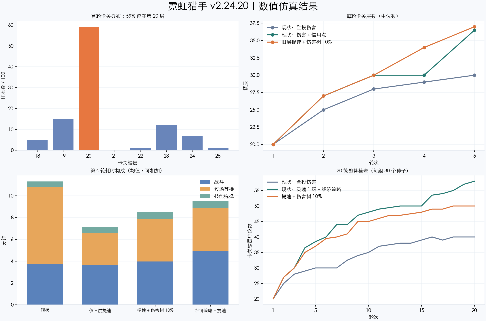

# 霓虹猎手 v2.24.20 数值仿真与优化建议

生成时间：2026-09-18 16:06。未修改游戏本体、玩家存档或历史日志。

## 结论

当前首轮循环基本成形，主要问题是后续大量重复爬楼，以及十层 Boss 造成的推进台阶。应先压缩旧层过场，再评估永久成长；不建议首先全面降低怪攻或升级成本。

在“偏攻击、及时合成、全投伤害树、无广告”的基准策略下，首卡中位数是第 20 层 / 13.5 分钟。第五轮卡在第 30 层 / 11.3 分钟，其中旧层重跑占比中位数 89.6%，纯过场等待占比 62.4%。两者不是同一指标：旧层重跑包含旧层战斗与过场。



## 仿真口径与可信范围

- 28 组情景，每组 100 个固定种子 × 5 轮；另有 3 组 30 个种子 × 20 轮。合计 **15,800 个完整循环**，未触发 90 分钟或 250 层的截断上限。
- 直接从 game/index.html 提取执行战斗循环、装备掉落、保底、合成、技能、升级、重塑、加成树和转场定时器；不使用旧 sim.py 的装备等效倍率。
- 基准为 390px 手机端、30 FPS、持续前台在线。每 2 秒检查一次操作并批量购买可负担的升级，攻击成本÷1.5与生命成本比较决定购买项；可合成即合成，然后拆解过期低品质件。其余策略见附录。
- 每次三选一等待 6 秒。基准属性技能优先火力→纳米→神经→护盾→生命→信用点→暴击→暴伤→碎片；触发器优先肾上腺素→迷彩→困兽→狂暴→杀戮→猎手。只从真实随机三选一候选中选择，不凭空授予技能。
- 默认不看广告、不领补给；重塑立即结算和分配树点，旧层开启现有 2 倍战斗速度。没有加入广告播放、重塑阅读、离开游戏或真人犹豫时间。
- 基准树策略为全投伤害，并非最优玩家策略。经济策略按“单位碎片相对伤害收益”和 0.5 权重的相对信用点收益贪心分配，属于启发式，也不是穷举最优。
- 视觉绘制、DOM 操作与日志落盘被替换为空操作；装饰性随机调用被移除，随机分布保留，但不声称与浏览器某一个随机种子逐帧相同。没有模拟掉帧、真实触控和 Safari 性能。
- 同时保留现实时间与战斗 dt：旧层 2 倍速只加速战斗，现有增益的 Date.now 计时与过场不随战斗倍率缩放。
- 表格均为中位数，图中耗时堆叠使用均值以便相加。基准首轮 P10–P90：**19–23 层、12.3–16.2 分钟**；这是样本分位区间，不是置信区间。
- 60 FPS 复核：首轮 20 层 / 13.2 分钟，第五轮 29.5 层 / 10.9 分钟；与 30 FPS 的总体判断一致。小于约半层或几十秒的差异不作强结论。
- 历史 S61（v2.17）首卡 22 层 / 14.46 分钟；S59（v2.16）为 26 层 / 21.55 分钟。S59 不能称为“约 14 分钟”。两者都早于当前护盾及技能重构，只作量级参照，不能视为当前模型已被真人校准。
- 长线样本最高只到 60 层，未覆盖第 100 层天枢的数值平衡。不能据此宣布全游戏或百层内容平衡完成。

## 1. 当前效果

| 轮次 | 卡关层数 | 单轮分钟 | 其中重跑旧层 |
|---|---:|---:|---:|
| 1 | 20 | 13.5 | 0.0 |
| 2 | 25 | 11.1 | 7.2 |
| 3 | 28 | 11.5 | 8.9 |
| 4 | 29 | 11.3 | 9.7 |
| 5 | 30 | 11.3 | 10.0 |


首轮 59/100 个样本死在第 20 层 Boss；基准前五轮共 500 次死亡全为血量归零，没有超时。第 20 层棱镜的血＋盾总量约为第 19 层普通 Boss 的 **1.38 倍**，而攻击另增 15%。此外，对盾伤害不吸血，导致吸血流也必须先撑过破盾阶段。

第一层通关时间中位数 **40.5 秒**，前 5 分钟通关约 **7 层**。若仍沿用早期“第一层 ≤25 秒”的目标，目前没有达到；初始攻击 8→10 也只降至 36.2 秒，单改基础攻击不足以达到该目标。

## 2. 操作与成长策略影响

| 情景 | 首卡层数 | 首轮分钟 | 第五轮卡关层数 | 第五轮分钟 |
|---|---:|---:|---:|---:|
| 基准：偏攻击＋及时合成 | 20 | 13.5 | 30 | 11.3 |
| 桌面端同策略 | 20 | 14.8 | 30 | 13.1 |
| 10 秒操作一次＋随机选技能 | 19 | 12.5 | 27 | 10.4 |
| 攻血均衡 | 20 | 13.9 | 30 | 11.3 |
| 更偏攻击 | 20 | 12.6 | 29 | 10.8 |
| 不合成 | 18 | 12.1 | 24 | 10.3 |
| 优先吸血、护盾和生命技能 | 20 | 14.0 | 30 | 11.5 |
| 伤害＋信用点树 | 20 | 13.5 | 36.5 | 14.3 |
| 先点 1 级灵魂，再伤害＋信用点树 | 20 | 13.5 | 39 | 14.5 |
| 第 15 层开补给＋重塑碎片翻倍 | 24 | 16.1 | 34 | 12.5 |


合成有实质作用：不合成使第五轮从 30 层降到 24 层。更偏攻击的策略跑得较快，但第五轮略浅，不能简单判定“全堆攻击永远最好”。续航技能优先也没有显著打破第 20/30 层的台阶。

经济树策略能让第五轮到 36.5 层，但单轮延长到 14.3 分钟；先买灵魂树 1 级后做经济配置可到 39 层 / 14.5 分钟，其中存在下述碎片向上取整优势。不能把基准的“第五轮 30 层”当成所有玩家的上限。

## 3. 参数对比

| 情景 | 首卡层数 | 首轮分钟 | 第五轮卡关层数 | 第五轮分钟 |
|---|---:|---:|---:|---:|
| 现状 | 20 | 13.5 | 30 | 11.3 |
| 成本增长 1.25→1.24 | 20 | 13.8 | 30 | 11.4 |
| 怪攻增长 1.15→1.14 | 23.5 | 16.3 | 35 | 13.4 |
| 棱镜护盾 80%→60% | 20 | 13.9 | 30 | 11.4 |
| 普通盾 50%→35%，棱镜盾 80%→60% | 20 | 13.6 | 30 | 11.2 |
| 初始攻击 8→10 | 24 | 14.4 | 35 | 12.6 |
| 伤害树每级 5%→7.5% | 20 | 13.5 | 31 | 11.2 |
| 伤害树每级 5%→10% | 20 | 13.5 | 37 | 13.4 |
| 仅旧层过场耗时 ×0.4 | 20 | 13.5 | 30 | 6.9 |
| 旧层过场 ×0.4＋伤害树 7.5% | 20 | 13.5 | 33 | 7.1 |
| 旧层过场 ×0.4＋伤害树 10% | 20 | 13.5 | 37 | 8.3 |


降低怪攻增长虽然把第五轮推到 35 层，却把首轮拉到 16.3 分钟。成本降低也没有解决重复爬楼时间。棱镜盾削到 60% 的单项实验，对中位首卡层数影响很小；暂不建议为此削弱 Boss 身份。

仅压缩旧层过场，保留首轮及新探索层的原节奏，第五轮从 11.3 分钟降到 6.9 分钟，约减少 39%；卡关层数基本不变。这是本轮最明确、影响面最小的改进。

## 4. 建议实施顺序

### P0：旧层快速重跑

启用条件：已重塑、已开启 2 倍速、当前楼层已经通关。把旧层死亡等待、跑入、跑出、切场与恢复战斗的整段过场时间压至现有的 40%；首轮与新边境保留现节奏。

仿真中所有旧层过场定时器整体缩放；真正落地时必须同步 CSS 动画时长，不能只改 setTimeout。更适合保留清晰的死亡/跑入短动画，并压掉停尸等待，避免人物动作机械地变快。人物就位后再恢复战斗，原有代次取消机制继续生效。

验收目标：同一策略第五轮中位时长下降至少 30%，卡关层数分布大致保持；首轮时长不变；无血条提前出现、瞬移或残留定时器。

经济树策略仅加此优化：第五轮 **36 层 / 9.3 分钟**（原为 36.5 层 / 14.3 分钟）；灵魂 1 级＋经济树策略为 **39 层 / 9.3 分钟**。说明提速收益不只存在于基准策略。

### P1：永久伤害提升，作为下一轮候选

保守候选：每级 **5%→7.5%**，叠加旧层提速，第五轮 **33 层 / 7.1 分钟**。

更明显的成长候选：每级 **5%→10%**，叠加旧层提速，第五轮 **37 层 / 8.3 分钟**；基准轮次中位数约为 **20→27→30→34→37 层**。经济树策略同方案第五轮 **40 层 / 9.5 分钟**，说明配点策略仍有影响。

建议先落地 P0 并做真人复测；如果仍有“连续重塑却推不远”的反馈，优先试 10% 候选。不能只把模拟中多推层数当成留存改善证据。调整时需同步 TREE_PCT、名称说明及预览，不只是 calcStats 内一处倍率。

### P1：纠正碎片加成的取整语义

当前规则为 ceil(基础掉落 × 树倍率 × 技能倍率)。基础掉落为 1 时，树 0 级掉 1，树 1 级（标称 +10%）立即掉 2；树 1～10 级均为 2，11 级才变 3。在没有共鸣技能时，前期出现“首级翻倍、后面多级不涨”的断层；树与技能叠加还会产生新的台阶。

建议改为**小数余量累计**：把额外的 0.1 暂存，累计到 1 再发完整碎片。显示的碎片仍为整数；余量需要存档、跨重塑保留，升级/读档不能丢失。直接改成 floor 会吞掉小额收益，不建议。

这是收益语义修正，同时会降低利用当前 ceil 优势的玩家产出，应单独版本验证并说明。仅“灵魂 1 级＋全投伤害”策略的余量累计实验，第五轮仍约 30 层 / 11.2 分钟；它没有覆盖所有经济流或高等级树配置，不应据此宣称无平衡影响。

### P2：给玩家更清楚的成长决策反馈

合成对第五轮推进影响约 6 层，建议在可合成时明确提示具体属性提升；首次重塑时展示伤害与信用点分支的实际收益，帮助用户理解经济树。技能“杀戮循环”与“狂暴节奏”同为暴击触发，后者单层幅度和持续时间均更强，应考虑给前者差异化用途；它们目前乘算叠加，有另一技能时不构成绝对支配关系。

这些 UI/技能改造本轮未实施，也未模拟其真人使用率变化。首层 40 秒问题可另做 1～5 层专门实验，避免为提速开局而永久放大全阶段伤害。

## 5. 长线检查

每组 30 个种子连续 20 轮：

| 策略/方案 | 第 10 轮卡关 | 第 20 轮卡关 | 第 20 轮分钟 |
|---|---:|---:|---:|
| 现状，全投伤害 | 35 | 40 | 13.5 |
| 现状，灵魂 1 级＋经济树 | 48 | 58 | 19.4 |
| 旧层提速＋伤害树 10%，全投伤害 | 45 | 50 | 8.8 |

样本范围内没有出现指数失控，但依然存在 30/40/50 层附近的重复卡关。P0 解决等待，P1 缓和成长；两者都没有消除长线平台期。由于当前无离线收益，如果目标是短时间看到百层内容，还需要另行设定“到达百层所需会话数/总时长”，并补充针对百层的实验。

## 6. 可复现文件与命令

- 仿真脚本：../balance-sim-v2.24.20.cjs
- 验证脚本：../balance-sim-check.cjs
- 报告/绘图脚本：../balance-report-v2.24.20.py
- 各情景 JSON：每轮卡关、时长、技能、装备、树配置与逐层记录；summary.json 保存分位汇总。extra/、recommended/、policy/ 为追加对照，long/ 为长线实验。
- 游戏源文件 SHA-256：`e405f6895dc11e210542f2411d8befb9f8795cfcb5de4f75b41616258fdb084b`。报告生成时再次检查全部结果对应同一份游戏源文件。

在项目目录运行：

```sh
node design/balance-sim-check.cjs
SEEDS=100 RUNS=5 SCENARIOS=baseline,replay_fast,growth_combo OUT=design/balance-rerun node design/balance-sim-v2.24.20.cjs
SEEDS=30 RUNS=20 SCENARIOS=baseline,soul_economy,growth_combo OUT=design/balance-rerun-long node design/balance-sim-v2.24.20.cjs
```

已验证：基础数值、升级成本、棱镜血盾、盾伤不吸血、生命升级补血、已装备参与合成、碎片取整、固定种子复现、连续重塑、时间分项总和，以及不合成的品质上限。旧 sim.py 保留作历史参考，当前数值判断使用本报告配套脚本。
