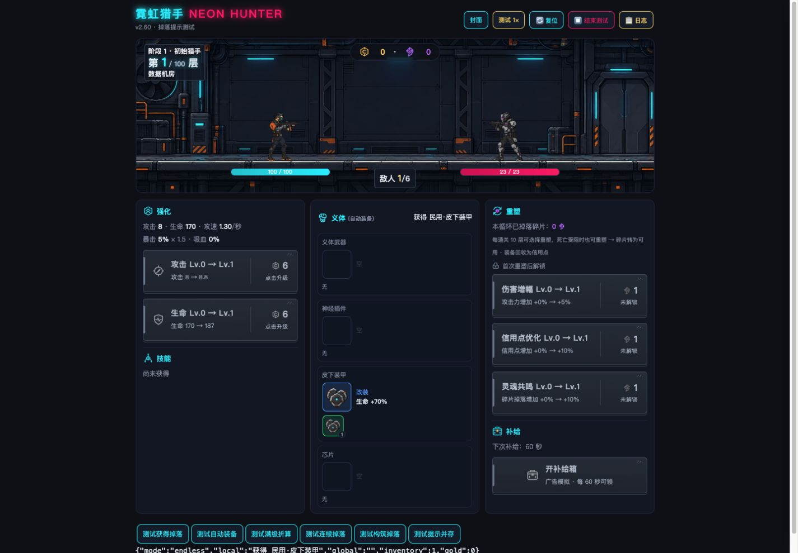
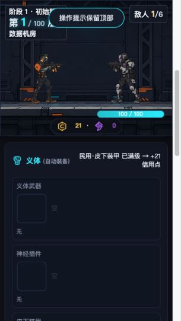

# v2.60 掉落提示位置调整

2026-09-22，**本次修改由Codex完成**，基线v2.59 → v2.60。用户授权执行R15。

将装备掉落提示从页面顶部移到义体面板标题右侧、用户红框指定区域。覆盖“获得装备”“自动装备”和“部位满级折算信用点”三种掉落结果，顶部不重复显示。合成、拆解、补给、技能获取等其他操作仍使用原全局提示。

新增局部状态区与独立计时器：沿用2.2秒显示时间，连续掉落更新为最新一条并重新计时；不积压队列。长名称可换行，标题与提示分栏，手机随面板自然排布。面板刷新不会提前清掉提示；成功重塑、义体改装和复位时清除旧提示。提示不进入存档。

- 正式文件：game/index.html（标题行HTML、局部CSS、dropRoll三处提示、showDropNotice/clearDropNotice以及成功重置的清理调用）。未改共享CSS。
- 参数/逻辑：掉落概率、品质、保底、物品入包/自动装备、最高品质折算公式保持。源码比较确认dropRoll除提示函数名外逐字一致；原toast函数逐字一致。
- 验证：既有核心75/76，唯一失败为原有C75跨版本日志保留条数，与v2.59结果相同；JavaScript语法与v2.60快照一致性通过。
- 浏览器：桌面1440×1000与窄屏320×568检查；获得/自动装备/满级折算、无尽与构筑、局部/顶部提示并存均实际点击验证。窄屏长文案不与标题、装备卡片重叠，也无横向溢出。
- 连续提示：第0ms掉落、第1200ms再次掉落，第2300ms仍显示第二条，第3500ms已清空，确认旧计时器不会提前隐藏新提示。控制台无error/warn。
- 浏览器测试在独立夹具中固定掉落品质/部位，调用正式dropRoll；夹具不进入发行代码。未做实体手机/长期游戏测试，无经济变化，未发布。

证据：browser-results.json、source-checks.json、final-core-results.json、desktop.png、mobile-narrow.png。build-fixture.py可重建验证入口，site/assets链接正式资源。

WorkBuddy可从v2.60直接接手，继续补真机触控和长期连续掉落显示验收。回退将baseline/index.html恢复为game/index.html；没有存档迁移或共享资源回退要求。未实际发送WorkBuddy会话消息。
