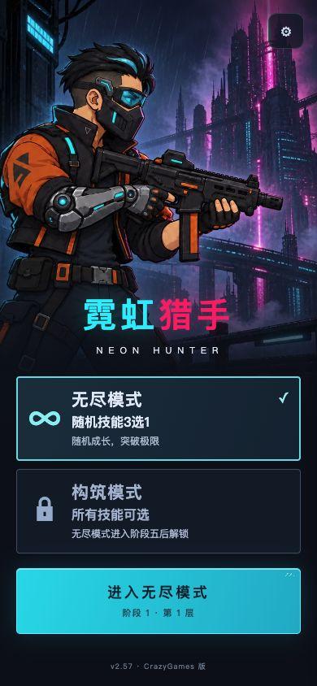
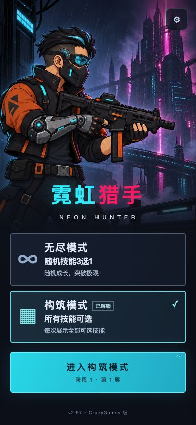
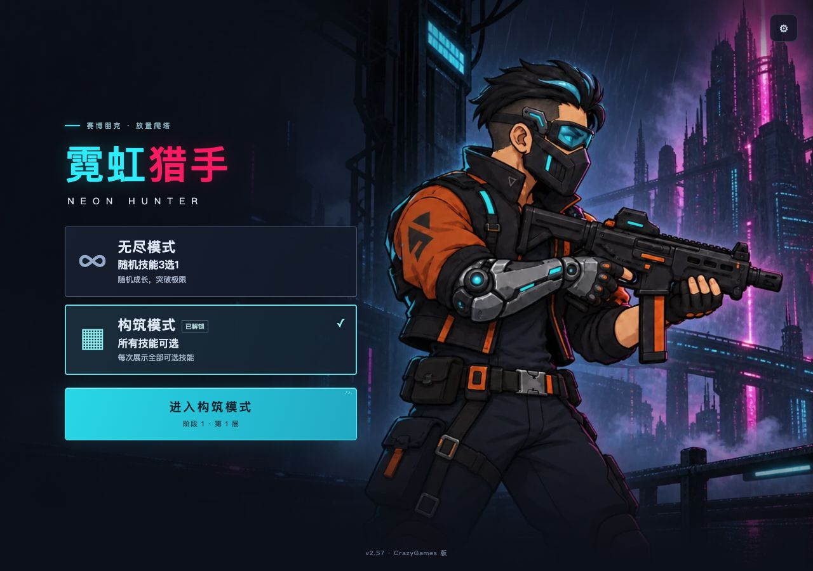
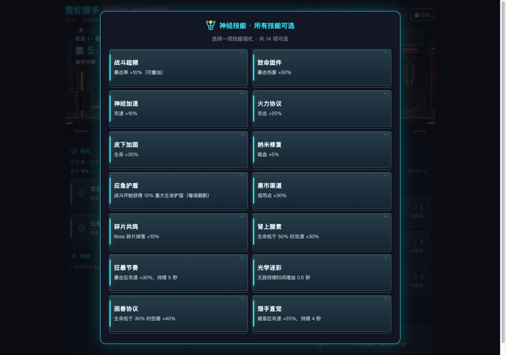
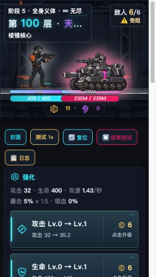

# v2.57 双模式封面与战斗HUD实施报告

日期：2026-09-22。修改者：**Codex**。基线v2.56 → v2.57。用户已通过封面v3并指示执行；R06/R07已落实。当前为本地版本，未发布。

## 已实现

- 封面保留夜城猎手美术，新增无尽/构筑两个灰蓝平面选择卡；选中态青色细边，进入按钮保持突出。文案为“随机技能3选1 / 所有技能可选”，锁定提示为“无尽模式进入阶段五后解锁”。不显示用户删除的顶部状态标签与“两种模式独立存档”说明。
- 无尽保留原5层条件池/10层常驻池随机三选一；构筑在同样的技能奖励节点展示全部14项，每次选择一项。包含所有有效定义、支持重复叠加、待选恢复和重复迷彩“增加0.5秒”；不恢复杀戮循环。
- 成功提交无尽阶段4→5后永久解锁，已有阶段五旧档自动解锁。阶段五仍按原义体改装规则从1层开始；没有跳过演出的入口。构筑自己的进度不能触发解锁。
- 构筑初始为阶段一、全部资源零，与无尽存档独立；五阶段、升级、重塑、补给、经济、装备与技能效果沿用现行规则。游戏内“封面”保存后返回模式选择；改装和弹窗期间不绕过流程。
- 阶段名/场景名桌面13px、手机12px，敌人数桌面14px、手机13px，增加字重与深色平面底衬，当前敌人数金色。长阶段/头目名单行截断并提供完整title，楼层优先；手机受阻提示另起一行。手机战斗区最小高度240px，为高阶段人物和HUD留空间，角色定位、血条与资源布局逻辑不变。

## 存档设计与兼容

| 数据 | 无尽 | 构筑 |
|---|---|---|
| 游戏进度 | `neonHunter`（原键） | `neonHunter.build` |
| 测试日志 | `neonHunterLogs` | `neonHunterLogs.build` |
| 旧版备份 | 原键`.preEconomy/.preStages` | 构筑键`.preEconomy/.preStages` |

共享配置`neonHunterModes`，schema=1，保存selected与buildUnlocked。每个游戏档新增mode字段；旧档缺失字段可读取，明确模式不符则保护原档并阻止写入。原stageSchema=2、economySchema=1继续沿用。

页面启动后模式固定；封面切换先保存当前档、持久化新选择，再刷新建立干净运行环境，避免旧广告/演出回调写另一模式。两种模式的强化、技能、装备、技能树、冷却、待选及改装恢复均位于各自完整快照。日志导出文件名新增模式段。

资源结算和复位使用localStorage单键setItem原子替换，不先删除原档。写失败不清内存资源、不切换模式；损坏存档保留原文，可导出或显式清除。清除阶段五无尽档前必须保存解锁记录，确保清档后资格仍在。解锁标记写失败时，已提交阶段五档仍可作为资格凭据；后续保存/切换重试。未知/损坏共享配置不覆盖，安全回到无尽，相关选择失败明确提示。

封面清档完成素材加载后才提交；如果存储失败，恢复可操作的原模式封面。复位仅作用于当前模式，另一模式与永久解锁保持。

## 验证结果

| 检查 | 实际结果 |
|---|---|
| 双模式专项（真实游戏函数、Node VM、存储/DOM桩） | 37/37 |
| 五阶段 | 40/40 |
| 阶段基础护盾 | 28/28 |
| v2.56补给、广告协调及无敌 | 58/58 |
| 杀戮循环删除 | 14/14 |
| 核心回归，修改前/后 | 均75/76 |

唯一核心失败C75为**原有跨版本自动封存日志保留4段、测试预期3段**，本轮未扩大范围修复；不是新增失败。Node验证使用实际源码函数，不等同于真机测试。

浏览器通过可见操作验证：

1. 全新封面构筑锁定；无尽按钮先显示真实素材加载进度，再进入战斗。
2. 测试夹具种入旧版阶段五无尽档后自动解锁。选择构筑显示阶段1第1层；进入、返回封面及切回无尽，原阶段5第11层/1234信用点/19碎片保留。
3. 构筑技能弹窗桌面两列14项；手机单列内部滚动。刷新再次进入仍恢复14项；实际点击末项“猎手直觉”只新增该项，重复光学迷彩文案正确。
4. 读取夹具可见诊断：无尽1234信用点不变，构筑87信用点和两项技能独立持久化，日志mode分别为endless/build。
5. 浏览器模拟构筑存储写失败：封面清档失败后仍在阶段1第5层，入口可操作，原87信用点及技能保留。恢复正常后清除构筑，只重置构筑，原无尽阶段/资源及解锁不变。
6. 390×844、320×568、1280×900、844×390封面检查：无横向溢出、进入入口可达。窄屏允许纵向滚动。阶段五长名称和受阻提示曾重叠，已修复：最终320宽标签与计数不重叠，人物头部不被信息底衬覆盖。
7. 多次浏览器控制台检查未见error/warn；最终证据见browser-console.json。技能/存储测试夹具只位于本报告site目录，不注入发行文件。

## 文件与证据

- 正式代码：`game/index.html`；新样式：`game/assets/start-screen/modes.css?v=2572`。
- 同步文档：需求登记R06/R07、MVP设计文档、文案表v6、数值调整记录、根交接、CHANGELOG。
- 快照：`game/versions/index_v2.57.html`，与主HTML逐字一致；外部样式随game/assets一起交付。
- 本目录`modes-tests.cjs`及各`*-results.json`：专项脚本与原始结果。运行示例：`GAME_HTML="$PWD/game/index.html" node design/qa-modes-v2.57-20260922/modes-tests.cjs`。
- `build-fixture.py`生成正式源码副本、可见种档/诊断页、故障与HUD边界页；只用于本机19457测试源。
- `browser-save-diagnostics.json`、`browser-reset-diagnostics.json`：通过夹具可见DOM读取的真实持久化结果。

### 界面实拍

早期hud-mobile.png/hud-stage5-mobile.png记录初轮效果；最终最小高度和受阻布局以hud-narrow-blocked.png、hud-stage5-blocked-mobile.png为准。

## 限制与接手

- 未发布，未接真实广告SDK；广告仍沿用明确标注的模拟。
- 未进行实体手机、跨浏览器完整兼容测试、构筑长期平衡仿真或真人通关。全部技能可选必然改变构筑策略和成长效率，本轮未改经济常数。
- 不新增同一模式多标签页并发锁；同模式仍沿用原来的最后写入结果。跨模式页面固定键及共享解锁保持已测试。
- WorkBuddy可直接从v2.57接手，优先补真机小屏/触控滚动、真实SDK和构筑长期体验验收。未实际发送会话消息。
- 回退：将本目录`baseline/index.html`恢复到`game/index.html`即可回到v2.56；新增modes.css不再被旧HTML引用。先备份三类存档及两个日志键。无尽原键继续可读；旧版不会读取构筑档与共享模式配置，保留它们供重新升级使用，不要删除。基线设计文件也保存在baseline目录。
