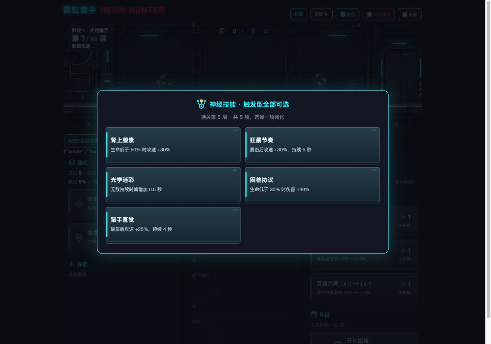
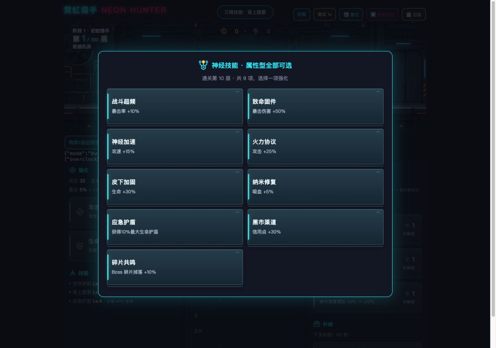
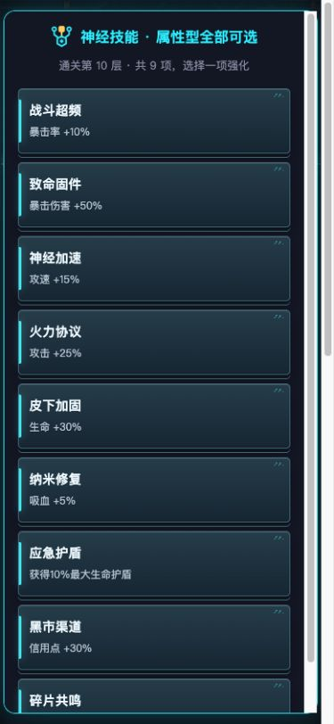

# v2.61 构筑模式按奖励楼层分池

2026-09-22，**本次修改由Codex完成**，v2.60 → v2.61。以用户纠正后的需求为准，修复对象是构筑模式。

## 原因与结果

原offerSkills在gameMode为build时直接使用Object.keys(SKILLS)，因此每次显示全部14项，绕过原有5层/10层两个技能池。现改为先根据实际通关的奖励层确定技能池，再按模式决定候选数量。

| 通关奖励节点 | 构筑模式 | 无尽模式 |
|---|---|---|
| 5、15、25…（尾数5） | 全部5项触发型，选1 | 触发池随机3选1 |
| 10、20、30…（10的倍数） | 全部9项属性型，选1 | 属性池随机3选1 |

触发型：肾上腺素、狂暴节奏、光学迷彩、困兽协议、猎手直觉。
属性型：战斗超频、致命固件、神经加速、火力协议、皮下加固、纳米修复、应急护盾、黑市渠道、碎片共鸣。

前四阶段第100层仍优先义体改装，不新增技能领取节点；第五阶段100、105、110层及更高奖励层遵循上表。

## 实现与兼容

- 新增skillPoolForFloor，由实际奖励层确定p5/p10；通关回调冻结已通关层，避免使用已推进的下一层。
- 构筑读取所选池全部技能（5/9），无尽在池内随机抽3项。奖励次数不变，每次只能领取1项。
- 旧构筑待选即使保存了全部14项，重新打开时也仅展示当前层所属池；无尽旧候选过滤跨池项并补足3个。正确候选保留原顺序。不会移除已经获得的技能或改写其等级/效果。
- 待选恢复会校正与楼层矛盾的池标记；缺少奖励层的旧待选按已推进的上一层补全。“继续挑战”以重塑里程碑层数为准，取消复位等挂起恢复也走统一校验。
- 弹窗显示“触发型全部可选 / 属性型全部可选”，列明通关层和候选数；无尽标明对应类型三选一。
- 封面保留用户指定主文案“所有技能可选”，构筑解锁后的副说明改为“5层触发型 · 10层属性型”。未解锁条件不变。
- 不改独立存档键、永久解锁、技能数值/持续时间、五阶段、掉落和v2.60局部掉落提示。无新存档字段。

## 验证

- 真实源码函数专项38/38：真实通关、混合/错误池旧档、缺失层、里程碑继续、挂起恢复、跨池领取阻止、单次领取、重复迷彩、阶段100层边界，以及构筑5/10/15/20/105/110节点。
- 同一专项在v2.60基线15/38，失败集中于新增分池/恢复规则和标题要求；基线无尽正常通关分池本身通过。未获取用户存档，不将合成的错误池测试数据描述为用户实际数据。
- 既有阶段40/40，核心75/76，唯一C75为原有跨版本日志保留4段/预期3段，与之前版本一致。
- 浏览器通过可见测试按钮实际保存、加载旧混合候选，验证构筑5/10/105层与无尽110层。桌面截图和390px手机检查：5/9项类型正确；9项列表可滚动、末项可选；最终无横向溢出、无控制台error/warn。测试诊断JSON曾引起页面溢出，已在夹具中换行修正，正式代码未受影响。
- JavaScript语法、主HTML与v2.61快照一致性检查通过。未做实体手机、真人长期构筑平衡或发布；广告SDK仍为原模拟。

## 文件与接手

正式文件：game/index.html；版本快照：game/versions/index_v2.61.html。需求登记R16、R06最新规则、文案表v7、MVP、CHANGELOG、数值记录与根交接同步。未修改共享CSS。

本目录pool-tests.cjs、harness.cjs与*-results.json为专项及回归证据；build-fixture.py生成的site只用于本机独立测试源，不进入发行代码。运行专项：

```sh
GAME_HTML="$PWD/game/index.html" node design/skill-pools-v2.61-20260922/pool-tests.cjs
```





WorkBuddy可直接从v2.61接手，补真机与构筑长期节奏验收。回退恢复baseline/index.html即可回到v2.60；没有共享CSS回退或存档迁移。旧版构筑将重新列出14项，不会删除新版本已获得的技能。未发布，未实际发送会话消息。
